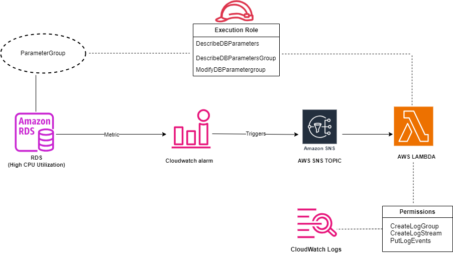
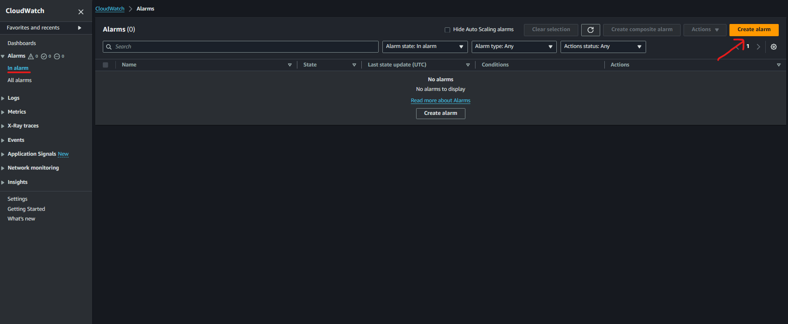
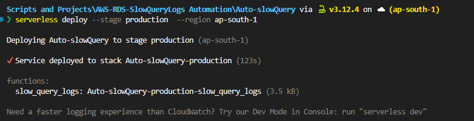

# Automating RDS Parameter Groups with AWS Lambda and SNS


### Why i created this workflow?

During periods of high CPU usage, our database performance often degraded due to slow-running queries, impacting application performance and user experience. The traditional manual process of identifying and mitigating these issues was inefficient and slow.

This workflow was developed to save manual effort and to capture the slow queries which lead to high resource utilization (CPU in our case), so instead of keeping the slow_query_log parameter turned on always, which was leading to huge slow_query.log files. We decided to turn on slow query whenever the CPU consumption crosses a threshold limit via this workflow which uses lambda, SNS and CloudWatch alarm. 

**What problem this workflow solved**

1. **Immediate Response**: The automated workflow ensures that during high CPU usage, the `slow_query_log` parameter is enabled, allowing for rapid identification and analysis of slow queries.
2. **Operational Efficiency**: By automating the adjustment of database parameters, the workflow reduces manual monitoring efforts, enabling the team to focus on other critical tasks.
3. **Enhanced Performance**: Dynamic management of database parameters helps maintain optimal performance and prevents degradation during peak loads.

**Workflow:**


### Resource Setup

### RDS

  If you don't have RDS in place here is how you can create it: 

  [https://aws.amazon.com/getting-started/hands-on/create-mysql-db/](https://aws.amazon.com/getting-started/hands-on/create-mysql-db/)

### CloudWatch Alarm

  Login to AWS Console and Go to CloudWatch console.

1. Click on **Alarms** on left-hand panel and then **create alarm**



b. Click on **Select Metric**.


  c. In the Select Metric menu, select **RDS**.


d. Then select **DBInstanceIdentifier**


e. Then in Metric Name, search for **CPUUtilzation**, and then click on **Select Metric**


f. In **Conditions**, specify the condition as per your requirement. Here I have chose **Static Threshold** and **Whenever CPUUtilzation is**.. **Greater/Equal** **than**… **80** (%)


g. In configure actions. When **Alarm state Trigger** as **In Alarm**

Choose the SNS topic we created on step 2.(SNS-Topic for this case is **my-database-high-cpu)
NOTE:** The SNS Topic will be created in the later part so you can skip this step and come-back again to modify once SNS topic is in place


h. Give your alarm a distinctive name.


i. Preview and Create the alarm. 

### Deploying Our Lambda Function via Serverless Framework

We will use Serverless framework to deploy lambda function and  Set Lambda Events as SNS.


💡 You will need AWS-CLIV2 installed and configured, below are important links
1. [Download](https://awscli.amazonaws.com/AWSCLIV2.msi) 
2. [Configuration](https://docs.aws.amazon.com/cli/latest/reference/configure/)


💡 To download and configure Serverless refer below:
1. [Serverless installation](https://www.serverless.com/framework/docs-getting-started)


### [i] Create a new Serverless project

1. choose AWS - Python - Starter

    
    
    
2. Give your project a name (i.e., `Auto-SlowQuery`)

    
    
    
3. Open handler.py

    
    
    
4. Paste the lambda function code in handler.py
To get the code refer : https://github.com/N1kh1lS1ngh25/Useful-Scripts/blob/main/Python-Scripts/rds_slow_query_parameter_toggle.py     
5. Modify `serverless.yml` as below:
<br>
    
    ```yaml
    service: Auto-slowQuery
    
    frameworkVersion: '3'
    
    provider:
      name: aws
      runtime: python3.9
    
    functions:
      slow_query_logs:                      # The logical name for the Lambda function                
        handler: handler.slow_query_logs    # Specifies the entry point of your Lambda function
        events:
          - sns: my-database-high-cpu       # Defines an SNS event source that triggers this Lambda function
    ```
    

### [ii] Deploying Lambda function

- Once Completed the above steps we are good to deploy our lambda Function `slow_query_logs` with SNS Event source ‘`my-database-high-cpu`’
- To deploy the lambda function run the below commands inside the Serverless directory created earlier.
    
    ```bash
    deploy --stage production --region ap-south-1
    ```
    
    
    
    **NOTE:** To check the progress you can check the CloudFormation stack in your AWS Console.
- The lambda function is now created and trigger event is configured as well.
    
    
     
- Attach below policy to the execution role of the lambda created
    
    ```json
    {
        "Version": "2012-10-17",
        "Statement": [
            {
                "Action": [
                    "logs:CreateLogStream",
                    "logs:CreateLogGroup",
                    "logs:TagResource"
                ],
                "Resource": [
                    "arn:aws:logs:ap-south-1:516978611867:log-group:/aws/lambda/Auto-slowQuery-production*:*"
                ],
                "Effect": "Allow"
            },
            {
                "Action": [
                    "logs:PutLogEvents"
                ],
                "Resource": [
                    "arn:aws:logs:ap-south-1:516978611867:log-group:/aws/lambda/Auto-slowQuery-production*:*:*"
                ],
                "Effect": "Allow"
            },
            {
                "Sid": "Statement1",
                "Effect": "Allow",
                "Action": [
                    "rds:DescribeDBParameterGroups",
                    "rds:DescribeDBParameters",
                    "rds:ModifyDBParameterGroup"
                ],
                "Resource": [
                    "arn:aws:rds:ap-south-1:516978611867:pg:my-database-pg"
                ]
            }
        ]
    }
    ```  
- Go to SNS Console and create and E-Mail Subscription as well to receive email whenever SNS message is delivered.

### Scope of improvement:

1. **Slow Query Log Analysis**:
    - Once the slow query logs are generated, they can be analyzed using tools such as **pt-query-digest** from the Percona Toolkit or MySQL’s default tool, **mysqlslowdump**.These tools provide detailed insights into query performance, allowing for the identification and optimization of slow queries.
    - The analyzed data can then be saved to an Amazon S3 bucket and a pre-signed URL can be generated to securely share the analyzed file, facilitating collaboration and further analysis.
2. **Exporting High CPU Usage Processes**:
    - During periods of high CPU usage, it is crucial to identify the processes consuming the most resources within the RDS instances so a list of these processes can be exported, providing a clear overview of resource-intensive operations.
    - This information helps in pinpointing specific queries or operations that may require optimization, contributing to better resource management and performance tuning.
